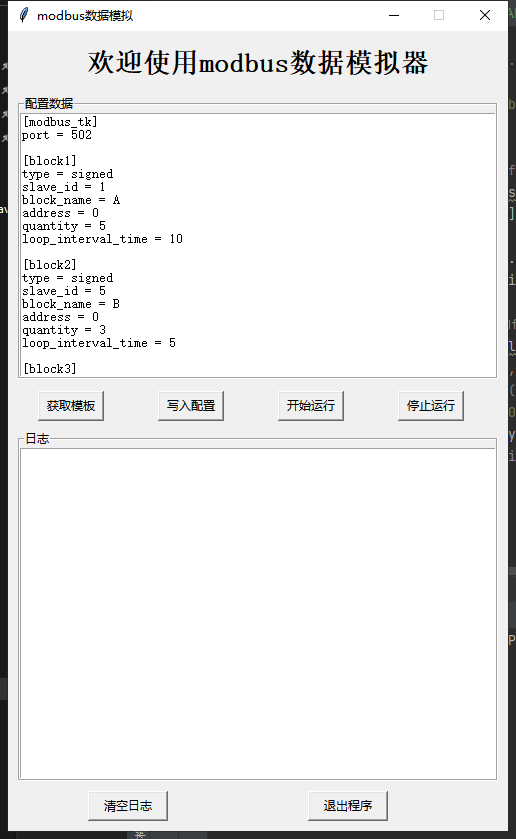

# Modbus_server
]
## 简介
基于python搭建的modbus服务，可以定时模拟发送信号，暂只支持int和float类型数据

## 使用方法
* **配置文件**:按照模板修改自己的格式，type暂时只有signed和float类型，slave_id和bloack_name不可以重复，loop_interval_time单位是秒，选择多少秒循环一次
* 图形化界面:打开GUI.py，先点击获取模板，然后再点击获取配置，按模板修改自己的格式
* 无图形化界面：先修改config.ini文件配置，按模板修改自己需要的的格式，之后运行main.py即可
